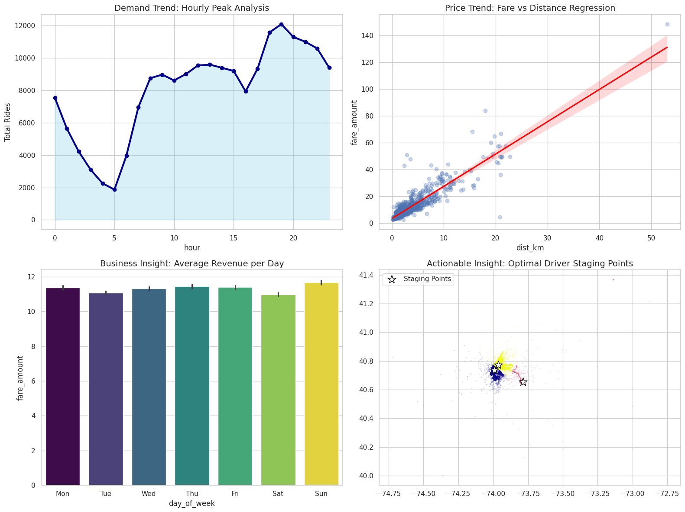
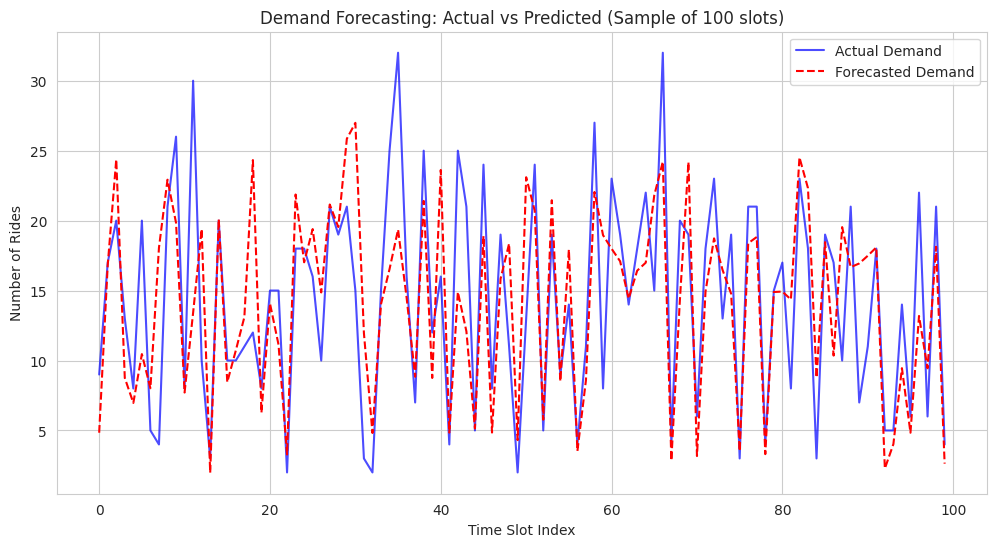

# Uber Demand Forecasting and Fare Prediction using Machine Learning

## Project Overview

This project presents an end-to-end machine learning pipeline for analyzing Uber trip data to extract business insights, forecast ride demand, predict trip fares, and identify high-demand pickup regions.

The workflow includes data preprocessing, feature engineering, exploratory data analysis, demand forecasting using Random Forest Regression, fare prediction using Linear Regression, and pickup hotspot identification through K-Means clustering.

The project demonstrates how machine learning can support intelligent transportation systems by improving demand estimation and operational decision-making.

---

## Quick Glance

| Attribute | Details |
|-----------|----------|
| **Project Type** | Machine Learning, Data Analytics |
| **Domain** | Intelligent Transportation Systems |
| **Dataset** | Uber Trip Dataset |
| **Programming Language** | Python |
| **Libraries** | Pandas, NumPy, Scikit-learn, Matplotlib, Seaborn |
| **Models Used** | Random Forest, Linear Regression, K-Means |
| **Tasks** | Demand Forecasting, Fare Prediction, Hotspot Analysis |

---

## System Architecture

<p align="center">

</p>

The architecture illustrates the complete machine learning pipeline from raw Uber trip records to predictive analytics and business insights.

---

## Project Workflow

<p align="center">

</p>

The workflow includes:

- Data acquisition
- Data preprocessing
- Feature engineering
- Exploratory data analysis
- Machine learning model training
- Demand forecasting
- Fare prediction
- Pickup hotspot identification
- Performance evaluation

---

## Repository Structure

```text
Uber-Demand-Forecasting/
│
├── uber.csv
│   
│   
│
├── notebooks/
│   └── Uber_Demand_Forecasting.ipynb
│
├── images/
│   ├── architecture.png
│   ├── workflow.png
│   ├── business_insights.png
│   └── demand_forecasting.png
│
├── requirements.txt
├── .gitignore
└── README.md
```

---

## Machine Learning Pipeline

1. Data Cleaning
   - Missing value handling
   - Duplicate removal
   - Data type conversion

2. Feature Engineering
   - Pickup hour
   - Day of week
   - Month
   - Trip distance (Haversine)
   - Passenger count

3. Exploratory Data Analysis

4. Model Development
   - Random Forest Regression
   - Linear Regression
   - K-Means Clustering

5. Model Evaluation
   - Mean Absolute Error (MAE)
   - Root Mean Squared Error (RMSE)
   - R² Score

---

## Technologies Used

- Python
- Pandas
- NumPy
- Scikit-learn
- Matplotlib
- Seaborn
- Jupyter Notebook

---

## Business Insights

Exploratory analysis was performed to understand travel patterns and generate actionable business insights.

The analysis includes:

- Hourly ride demand trend
- Fare versus travel distance relationship
- Average revenue by weekday
- Pickup hotspot identification using K-Means clustering

<p align="center">

</p>

---

## Results

### Demand Forecasting

Random Forest Regression was used to predict ride demand across different time slots. The predicted values closely follow the actual demand, demonstrating the model's capability to capture temporal demand patterns.

<p align="center">

</p>

---

## Key Features

- End-to-end machine learning pipeline
- Demand forecasting using Random Forest Regression
- Fare prediction using Linear Regression
- Pickup hotspot detection using K-Means clustering
- Feature engineering for transportation analytics
- Business insight generation through visual analytics
- Clean and modular project organization

---

## Future Improvements

- Time-series forecasting using LSTM or Prophet
- Real-time demand prediction
- Weather-aware demand forecasting
- Traffic-aware fare estimation
- Interactive dashboard using Streamlit
- Deployment as a REST API

---

## Author

**Vibha I S**

B.E. Electronics and Communication Engineering

---

## License

This project is licensed under the MIT License.
